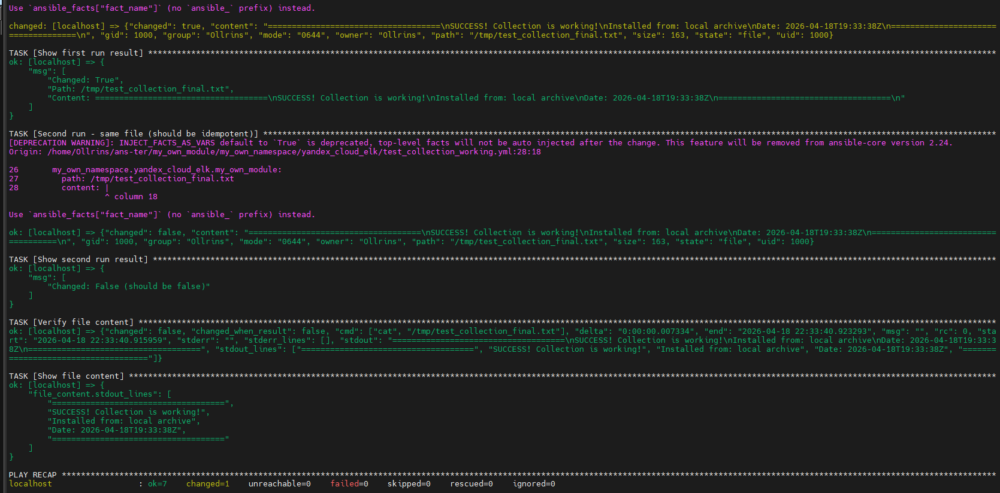

### Домашнее задание к занятию 6 «Создание собственных модулей»

#### Задание 4

 

  
   
  <em> Проверка module на исполняемость локально. </em>

 

  
   

#### Задание 6

 

  
   
  <em> Проверька через playbook на идемпотентность. </em>

#### Задание 15

 

  
   
  <em> Результат установки collection из локального архива </em>

#### Задание 16

 

  
   
  <em>  Запуск playbook </em>

