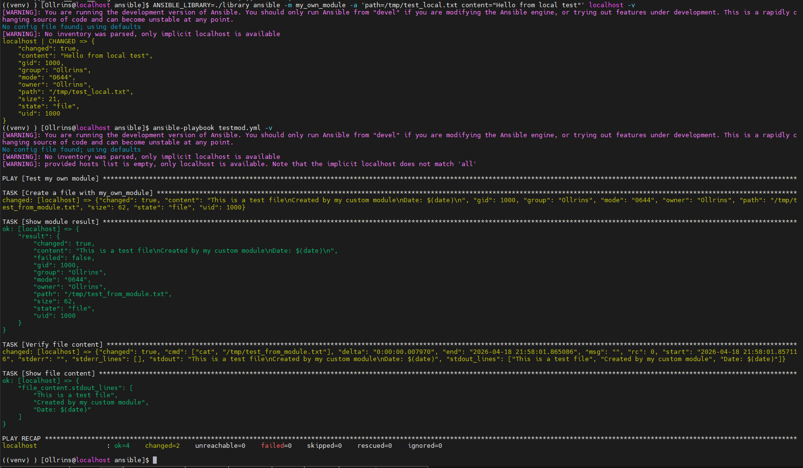
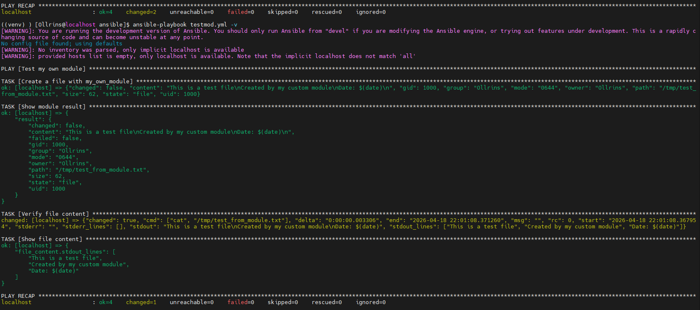
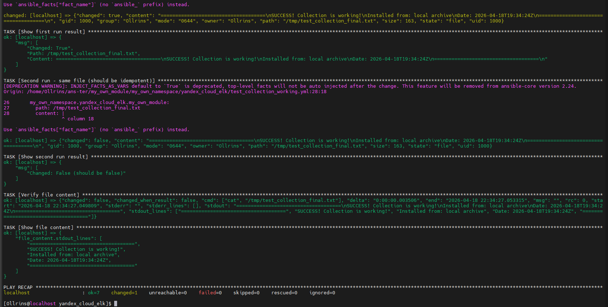
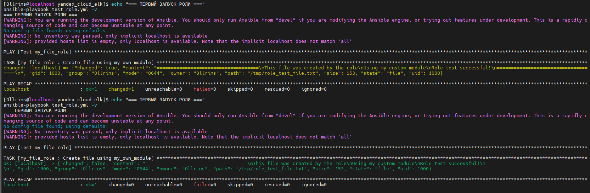

### Домашнее задание к занятию 6 «Создание собственных модулей»

#### Задание 4

 

  
   
  <em> Проверка module на исполняемость локально. </em>

#### Задание 6

 

  
   
  <em> Проверка через playbook на идемпотентность. </em>

#### Задание 15

 

  
  <em> Установка collection из локального архива.  </em>
   

#### Задание 16

 

  
   
  <em>  Запуск playbook </em>

